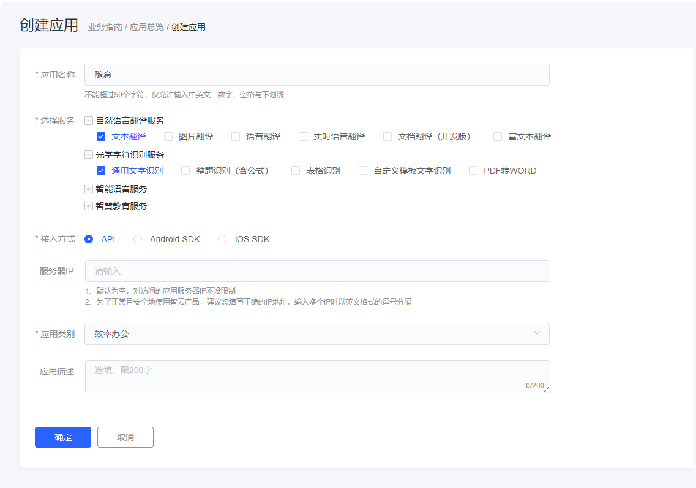
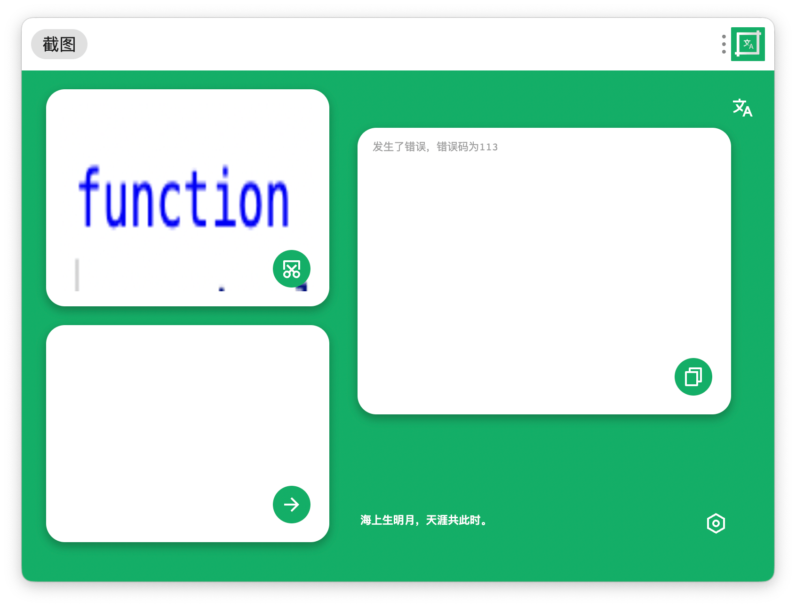

# 截图翻译

就一个普普通通的utools插件
注：代码里的appID和appSec无效，请自行在[有道开放平台](https://ai.youdao.com/)申请！

作者：Hitao

## 下载

会在插件商店发，github同步更新upx(包括测试版）

## 初始化
本应用不附带appid，请自行注册申请。
1.在[有道开放平台](https://ai.youdao.com/)注册一个账号
2.登录控制台，在[应用总览](https://ai.youdao.com/console/#/app-overview)创建一个应用，应用名称随意，服务包括自然语言翻译服务下的文本翻译，光学字符识别服务下的通用文字识别，接入方式为api,
应用类别选择效率办公

3.在[应用总览](https://ai.youdao.com/console/#/app-overview)中，找到你创建的应用，复制应用id和密钥
4.打开插件，点击右下设置，分别在appID填入应用id,appSec中填入密钥
5.可以开始使用了

## 错误
使用过程中，若发现如图示的错误，请在[翻译错误](https://ai.youdao.com/DOCSIRMA/html/%E8%87%AA%E7%84%B6%E8%AF%AD%E8%A8%80%E7%BF%BB%E8%AF%91/API%E6%96%87%E6%A1%A3/%E6%96%87%E6%9C%AC%E7%BF%BB%E8%AF%91%E6%9C%8D%E5%8A%A1/%E6%96%87%E6%9C%AC%E7%BF%BB%E8%AF%91%E6%9C%8D%E5%8A%A1-API%E6%96%87%E6%A1%A3.html#section-11)和[OCR错误](https://ai.youdao.com/DOCSIRMA/html/%E6%96%87%E5%AD%97%E8%AF%86%E5%88%ABOCR/API%E6%96%87%E6%A1%A3/%E9%80%9A%E7%94%A8%E6%96%87%E5%AD%97%E8%AF%86%E5%88%AB%E6%9C%8D%E5%8A%A1/%E9%80%9A%E7%94%A8%E6%96%87%E5%AD%97%E8%AF%86%E5%88%AB%E6%9C%8D%E5%8A%A1-API%E6%96%87%E6%A1%A3.html#section-10)中对照，有问题可以发issue或发邮件至2175176366@qq.com

## 功能

### 截图翻译

utools-“截图”“翻译”两个关键词，截图，右框即为所求。

### 图片翻译

utools选择图片-选择翻译

 

## 小目标

- [x] 截图并翻译
- [x] 图片翻译
- [ ] 可更换api平台
- [ ] 下方诗句每日更换
- [ ] 加入一键百度搜索功能