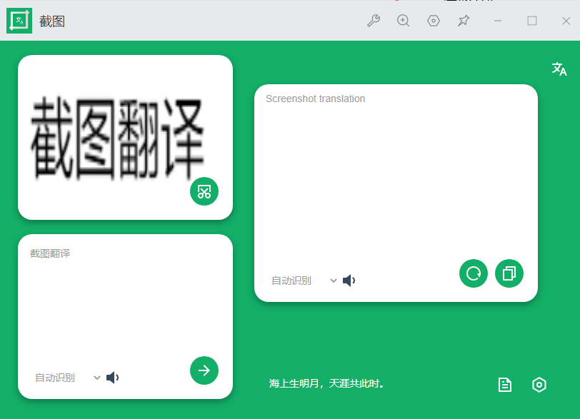
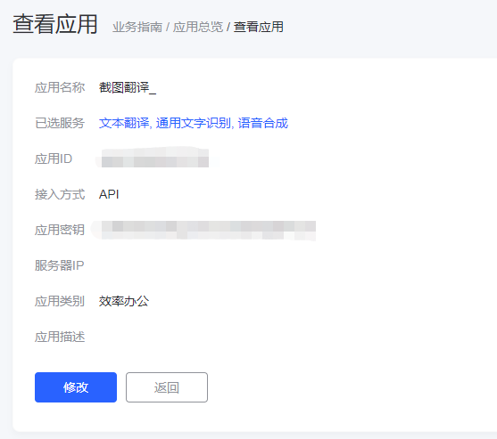
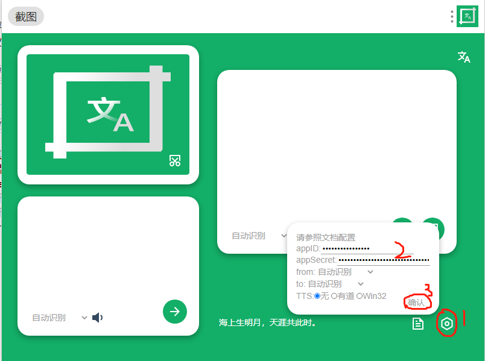
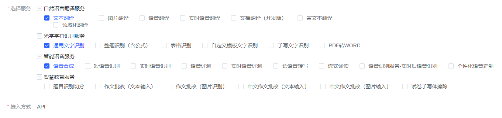
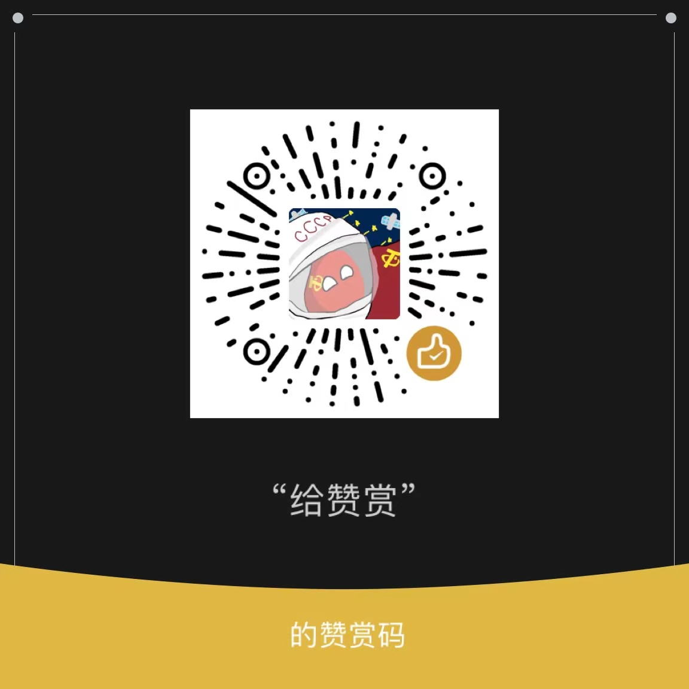

# 截图翻译
>一截，一翻，so easy 

这是一款utools插件，需要基于[utools](https://u.tools)使用。

## 功能介绍
* 截图翻译
* 图片翻译
* TTS文本朗读
## 快速开始
由于本插件基于有道提供的API运行 ~~(其实是有道APIGUI版本)~~,在正式使用之前，您需要先配置有道提供的API。

至于如何配置，我们更推荐您阅读[「划词翻译」]("https://hcfy.app/docs/services/youdao-api")提供的教程

在完成配置后，您可以找到如下界面

按下`Alt`+`Space`,调出utools输入框，输入关键词`jt`，选择「截图翻译」，在进入截图界面时右键，进入主界面

如图示，在appID和appSecret中分别填入上述应用ID和应用密钥，单击确认即可

> 以上配置信息只会在utools提供的本地数据库中保存，如果您发现应用异常，请立即重置密钥

至此，您可以开始截图翻译/图片翻译之旅了。

## 其它配置
### 指定翻译语言

在默认情况下，「截图翻译」将自动选择语言。但在部分情况下，它往往并不好用，因此，在新版本中，您可以自行选择语言。

在两个文本框下方的语言选项中选择语言，在点击右侧刷新按钮，「截图翻译」将会重新ocr并翻译。

在设置中，您同样可以选择默认的翻译语言，即from和to两个选项。

### 文字转语音

「截图翻译」中自带两种tts。对于windows用户，我们更加推荐使用win32（系统自带），对于其它系统用户，您只能选择有道。

使用win32无需任何其它配置。而使用有道的用户，需要在应用设置中勾选语音合成。

## 错误汇总
|错误码|原因|
|---|---|
|102|不支持的语言类型|
|103|翻译文本过长|
|108|应用ID无效，注册账号，登录后台创建应用和实例并完成绑定，可获得应用ID和应用密钥等信息|
|110|无相关服务的有效实例，应用没有绑定服务实例，可以新建服务实例，绑定服务实例。注：某些服务的结果发音需要tts实例，需要在控制台创建语音合成实例绑定应用后方能使用。|
|111|	开发者账号无效|
|113|q不能为空（注：可能是因为翻译为空）|
|205|	请求的接口与应用的平台类型不一致，确保接入方式（Android SDK、IOS SDK、API）与创建的应用平台类型一致|
|206|因为时间戳无效导致签名校验失败（注：请确认系统时间）|
|401|	账户已经欠费停|
|411|访问频率受限,请稍后访问|

请以[有道OCR文档](https://ai.youdao.com/DOCSIRMA/html/%E6%96%87%E5%AD%97%E8%AF%86%E5%88%ABOCR/API%E6%96%87%E6%A1%A3/%E9%80%9A%E7%94%A8%E6%96%87%E5%AD%97%E8%AF%86%E5%88%AB%E6%9C%8D%E5%8A%A1/%E9%80%9A%E7%94%A8%E6%96%87%E5%AD%97%E8%AF%86%E5%88%AB%E6%9C%8D%E5%8A%A1-API%E6%96%87%E6%A1%A3.html#section-11)和[有道翻译文档](https://ai.youdao.com/DOCSIRMA/html/%E8%87%AA%E7%84%B6%E8%AF%AD%E8%A8%80%E7%BF%BB%E8%AF%91/API%E6%96%87%E6%A1%A3/%E6%96%87%E6%9C%AC%E7%BF%BB%E8%AF%91%E6%9C%8D%E5%8A%A1/%E6%96%87%E6%9C%AC%E7%BF%BB%E8%AF%91%E6%9C%8D%E5%8A%A1-API%E6%96%87%E6%A1%A3.html#section-14)为准

## Next
[ ] 支持更多api平台

## 开源使用
[str2gbk](https:/github.com/EtherDream/str2gbk):https://github.com/EtherDream/str2gbk
[remixIcon](https://github.com/Remix-Design/RemixIcon):https://github.com/Remix-Design/RemixIcon
## 赞助我们

## 开源协议
Apache Licence 2.0