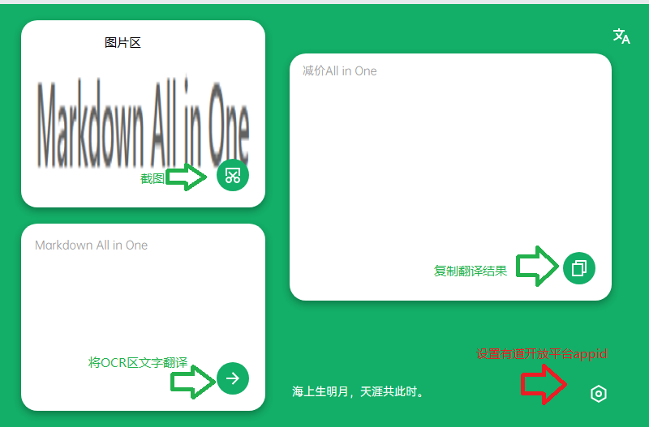

# 截图翻译

就一个普普通通的utools插件
注：代码里的appID和appSec无效，请自行在[有道开放平台](https://ai.youdao.com/)申请！

作者：Hitao

代码写的不太好，轻喷

## 下载

会在插件商店发，github同步更新upx(包括测试版）

## 功能

### 截图翻译

utools-“截图”“翻译”两个关键词，截图，右框即为所求。

### 图片翻译

utools选择图片-选择翻译

 

## 小目标

- [x] 截图并翻译
- [x] 图片翻译
- [ ] 可更换api平台
- [ ] 下方诗句每日更换
- [ ] 加入一键百度搜索功能